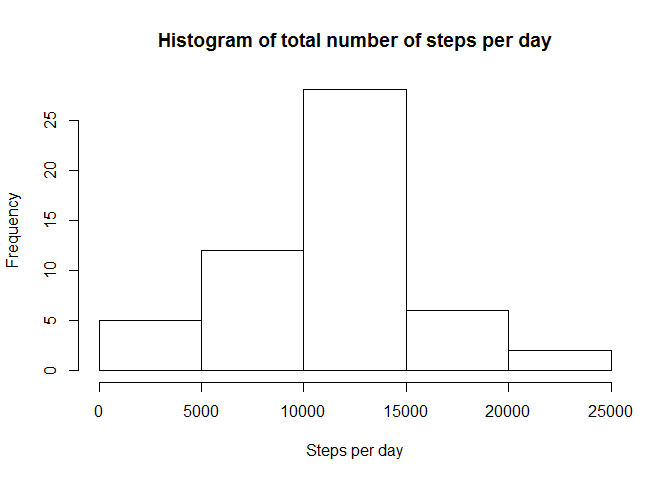
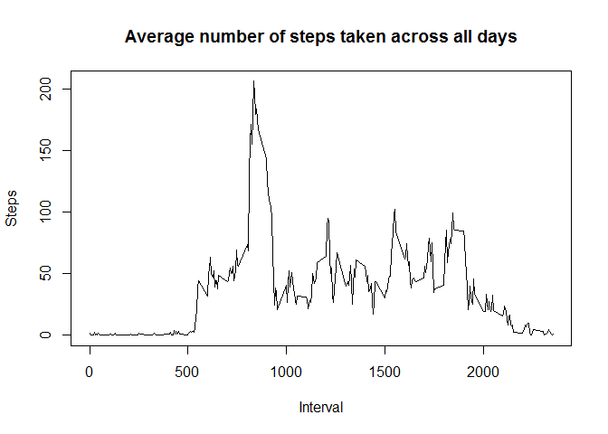
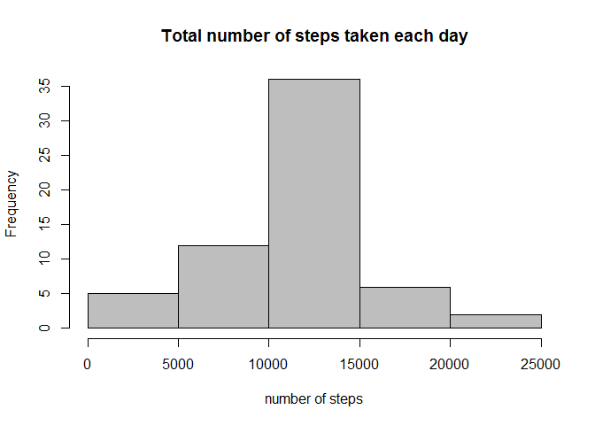
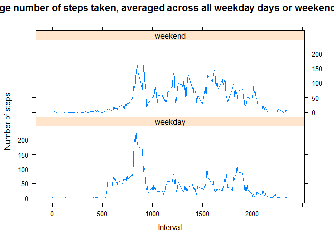

# Reproducible Research: Peer Assessment 1


## Loading and preprocessing the data

```r
if(!file.exists("./activity.csv"))
{
  unzip("./activity.zip", exdir = ".")
}
activityData <- read.csv("activity.csv")
```

## What is mean total number of steps taken per day?

```r
StepsByDate <-aggregate(activityData$steps,by=list(activityData$date),sum)
names(StepsByDate)<-c("Date","Steps")
hist(StepsByDate$Steps, main = "Histogram of total number of steps per day", xlab = "Steps per day")
```

<!-- -->

```r
mean_steps<-mean(StepsByDate$Steps,na.rm = TRUE)
median_steps<-median(StepsByDate$Steps,na.rm = TRUE)
```
* Mean Steps by Day: 1.0766189\times 10^{4}
* Median Steps by Day:  10765

## What is the average daily activity pattern?

```r
dt_agg_int <- aggregate(steps ~ interval, FUN=mean, data=activityData)
plot(x=dt_agg_int$interval
   , y=dt_agg_int$steps
   , type="l"
   , main="Average number of steps taken across all days"
   , xlab="Interval"
   , ylab="Steps")
```

<!-- -->

### Which 5-minute interval, on average across all the days in the dataset, contains the maximum number of steps?

```r
max_steps_row <- which.max(dt_agg_int$steps)
dt_agg_int[max_steps_row, ]
```

```
##     interval    steps
## 104      835 206.1698
```

## Imputing missing values
###Calculate and report the total number of missing values in the dataset (i.e. the total number of rows with NAs)

```r
sum(is.na(activityData))
```

```
## [1] 2304
```
###Devise a strategy for filling in all of the missing values in the dataset. The strategy does not need to be sophisticated. For example, you could use the mean/median for that day, or the mean for that 5-minute interval, etc.
###Create a new dataset that is equal to the original dataset but with the missing data filled in.

```r
dt_agg_int_mean <- aggregate(steps ~ interval, FUN=mean, data=activityData)
dt_conv_merge <- merge(x=activityData, y=dt_agg_int_mean, by="interval")
dt_conv_merge$steps <- ifelse(is.na(dt_conv_merge$steps.x), dt_conv_merge$steps.y, dt_conv_merge$steps.x) 
dt_conv_na <- dt_conv_merge[c("steps", "date", "interval")]
```

###Make a histogram of the total number of steps taken each day.

```r
dt_agg_day_na <- aggregate(steps ~ date, FUN=sum, data=dt_conv_na)
vt_agg_day_na <- dt_agg_day_na$steps
names(vt_agg_day_na) <- dt_agg_day_na$date 
hist(dt_agg_day_na$steps, xlab="number of steps", main="Total number of steps taken each day",col="gray")
```

<!-- -->
###Calculate and report the mean and median total number of steps taken per day. 

```r
v_mean_na <- (mean(dt_agg_day_na$steps))
v_median_na <- factor(median(dt_agg_day_na$steps))
print(v_mean_na)
```

```
## [1] 10766.19
```

```r
print(v_median_na)
```

```
## [1] 10766.1886792453
## Levels: 10766.1886792453
```

###Do these values differ from the estimates from the first part of the assignment? What is the impact of imputing missing data on the estimates of the total daily number of steps?
###Yes, By replacing the missing value with the average of the interval, the median is shifted closer to the mean.


## Are there differences in activity patterns between weekdays and weekends?
###Create a new factor variable in the dataset with two levels - "weekday" and "weekend" indicating whether a given date is a weekday or weekend day.

```r
dt_conv_na$weekdays <-  ifelse(as.POSIXlt(dt_conv_na$date)$wday %in% c(0,6), 'weekend', 'weekday')
```

###Make a panel plot containing a time series plot (i.e. type = "l") of the 5-minute interval (x-axis) and the average number of steps taken, averaged across all weekday days or weekend days (y-axis). See the README file in the GitHub repository to see an example of what this plot should look like using simulated data.

```r
library(lattice)
dt_agg_weekdays <- aggregate(steps ~ weekdays + interval, FUN=mean, data=dt_conv_na)

xyplot(steps ~ interval | weekdays, dt_agg_weekdays
     , type = "l"
     , xlab = "Interval"
     , ylab = "Number of steps"
     , main = "Average number of steps taken, averaged across all weekday days or weekend days"
     , layout = c(1, 2))
```

<!-- -->
